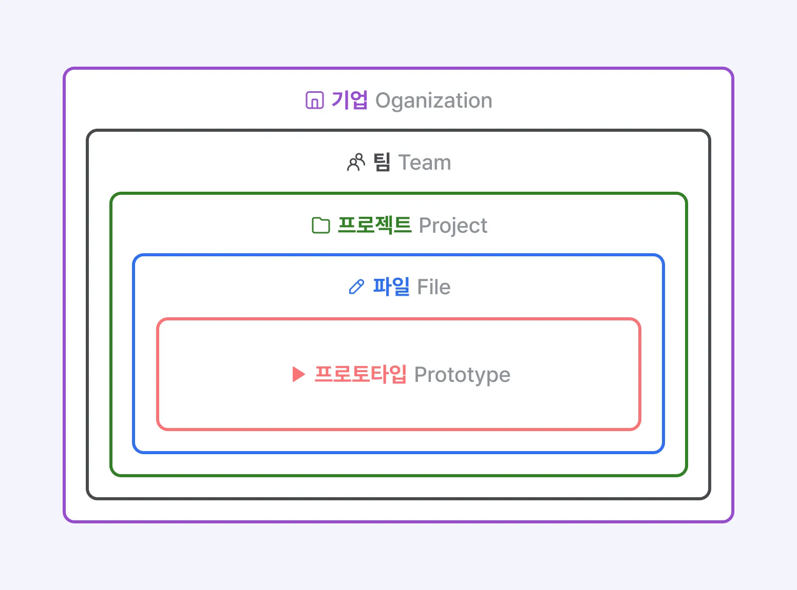

# Figma?

## 디자인계의 깃허브같은거

| 단계                          | 기능                        | 설명                                                                             |
| ----------------------------- | --------------------------- | -------------------------------------------------------------------------------- |
| **1. 아이디어 구상**          | **FigJam(피그잼)**          | **디지털 화이트보드로 브레인스토밍, 아이디어 맵, 회의록 정리 등 협업 기획 진행** |
| **2. 기획안 공유 & 피드백**   | **Slides(슬라이즈)**        | **프레젠테이션 형태로 기획 방향 및 아이디어 정리, 팀과 이해관계자에게 공유**     |
| **3. 서비스 프로토타입 생성** | **Make(메이크)**            | **AI 활용으로 간단한 프로토타입 생성 또는 자동화된 기능 제안**                   |
| **4. 디자인 작업, 개발 협업** | **Figma Design & Dev Mode** | **UI/UX 디자인 작업 진행, 디자인 시스템 구축, 디자이너-개발자 핸드오프**         |
| **5. 반응형 웹사이트 배포**   | **Sites(사이트)**           | **반응형 웹사이트를 디자인하고 바로 퍼블리싱 가능**                              |
| **6. 브랜드 일관성 관리**     | **Buzz(버즈)**              | **브랜드 에셋(로고, 컬러, 컴포넌트 등) 중앙 관리 및 팀 공유**                    |

# 개발자가 피그마 배워야 하는 이유

디자이너와 FE개발자는 서로의 작업에 대한 이해를 가져야 빠르게 의사소통 가능

# 피그마 파일 구성 방식

# 사용법

캔버스 확대/축소 : ctrl+마우스 스크롤
캔버스 내 시점이동 : 스페이스바 누른채 이동

## 캔버스 내 개체 선택

### 하위 레이어 요소 선택

더블 클릭하여 그룹 내부 요소 선택
ctrl 클릭
레이어 패널 활용

### 상위 레이어 요소 선택

개별요소 선택 > 마우스 우클릭 > select layer > 해당 상위 그룹 레이어 선택

# 요소 간격 확인

개별 요소 선택후 Alt 누른후 간격 대상에 마우스 hover

# Code 추출하기

요소 선택 > 마우스 우클릭 > copy as > 원하는 옵션 선택

# Properties 탭에서 속성 확인

캔버스 내에 선택한 요소의 상세 속성은 우측의 properties에서 확인 가능

# Export

| 파일 형식 | 설명                                                                                                       |
| --------- | ---------------------------------------------------------------------------------------------------------- |
| **PNG**   | 알파 값(투명도)을 포함한 비트맵 이미지입니다. 로고, 아이콘 등 배경이 투명한 이미지를 출력할 때 적합합니다. |
| **JPG**   | 비트맵 이미지입니다. 그림, 사진과 같은 이미지를 출력할 때 적합합니다.                                      |
| **SVG**   | **벡터 파일 포멧**입니다. 로고, 아이콘 등 해상도에 따른 손실이 없어야 하는 요소를 출력할 때 적합합니다.    |
| **PDF**   | 벡터 요소를 다른 툴로 이동하여 편집해야 하는 경우, 인쇄해야 하는 경우 등 PDF로도 출력이 가능합니다.        |
