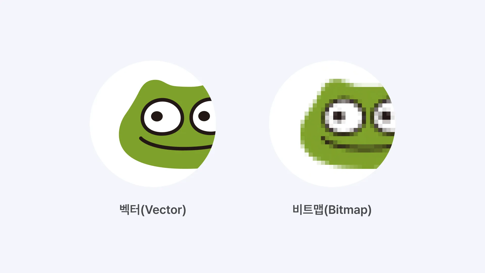

# 벡터와 비트맵

## 비트맵

서로 다른 점(픽셀)들의 조합으로 그려진 이미지

## 벡터

점과 점을 연결하여 수학적 원리로 그려지는 방식

|                                                | 벡터(Vector)                                       | 비트맵(Bitmap)                                     |
| ---------------------------------------------- | -------------------------------------------------- | -------------------------------------------------- |
| 장점                                           | 확대하거나 축소해도 해상도에 영향을 끼치지 않는다. | 정교하고 다양한 색상을 가진 이미지를 만들 수 있다. |
| 단점                                           | 정교한 이미지, 그래픽 표현에는 적합하지 않음       | - 이미지가 깨질 수 있음                            |
| - 대형 출력물 제작 시 용량이 너무 커질 수 있음 |
| 형식/확장자                                    | AI, EPS, SVG                                       | JPG, PNG, BMP, GIF                                 |
| 적합한 사용 용도                               | 로고, 아이콘, 일러스트 등                          | 사진, 이미지, 그래픽 등                            |
